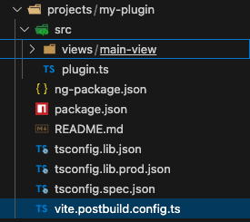

# Plugin compilation in two steps

Unlike other technologies, Angular has its own bundler, which is why we will need to do a compilation in two steps. One for Angular, and the other with Vite:

# 1- Compilation with Angular
When developing a library in Angular, the standard build process (`ng build`) generates various formats to ensure compatibility. One of the key formats is FESM (Flat EcmaScript Module), often located in a directory such as `dist/your-library/fesm2022`.
When Angular compiles the library to formats such as FESM, by default, it does not include the main external dependencies. It assumes that the application consuming the library will already have these dependencies available in its own environment.
This can be beneficial to avoid code duplication, but in this case the plugin will need specific dependencies that the `shell` will not provide.
Therefore, in this first step we will have to execute the following command:

```bash
ng build my-plugin --configuration production
```

This will create a `my-plugin.mjs` file at the location `projects/my-plugin/dist/fesm2022`.

# 2- Compilation with Vite, configuration, file location and name
Since the plugin will need other dependencies, it will be necessary to do a second compilation with Vite to include the external libraries that the plugin needs. This is where the creation of the `vite.postbuild.config.ts` file at the root of our plugin folder comes in. In the example it is located at `projects/my-plugin/vite.postbuild.config.ts`:



And the file would be the following:

```typescript
import { defineConfig } from 'vite';
import path from 'path';
import pckg from './package.json';

export default defineConfig({
  build: {
    lib: {
      entry: path.resolve(__dirname, `dist/fesm2022/${pckg.name}.mjs`),
      formats: ['es'],
      fileName: () => `${pckg.name}-bundled.js`
    },
    rollupOptions: {
      external: [
        '@angular/animations',
        '@angular/common',
        '@angular/compiler',
        '@angular/core',
        '@angular/forms',
        '@angular/platform-browser',
        '@angular/router',
        '@uxland/primary-shell',
        'rxjs'
      ]
    }
  }
});
```


With this second step, a new bundle is created, with the purpose of creating a final bundle that does include those external libraries that the plugin needs and that are not guaranteed by the `shell`.

The Angular build generates several files, often with extensions like .mjs. The Vite build, configured as in our example, will generate a single JavaScript file (.js).
The name of this final file is determined by the `fileName` configuration inside `build.lib` in the `vite.postbuild.config.ts` file. In our example, it is called `${pckg.name}-bundled.js`.
Since Angular compiles with the package name to the bundle (`${pckg.name}`), it is used precisely to build the expected path to the FESM file generated by the build. This ensures that Vite knows exactly which input file to process from the output of the previous build.

This process is done since Angular compilation is special, and this gives finer control over how it is compiled, allowing to decide which external dependencies should be included in the final bundle.

You will have to go to the plugin folder:
```bash
cd projects/my-plugin
```

And subsequently you will have to execute the following command:

```bash
vite build --config vite.postbuild.config.ts
```

This will create the `my-plugin-bundled.js` file at this location -> `projects/my-plugin/dist`.

# Possibility to unify the two steps with a script
There is the possibility to perform these two steps in one, through a script in the `package.json` of the project root that performs the two calls. In the example shown above (https://stackblitz.com/~/github.com/uxland/harmonix-angular-plugin-demo) we have the following script:
```
"build:plugin": "ng build my-plugin --configuration production && cd projects/my-plugin && vite build --config vite.postbuild.config.ts",
```
Continuing with the example, there are also the different external libraries provided by the shell, which would not need to be modified.


The compiled files will be generated in `projects/my-plugin/dist`, and the `my-plugin-bundled.js` file should be uploaded renamed to your preference to the plugin store.
