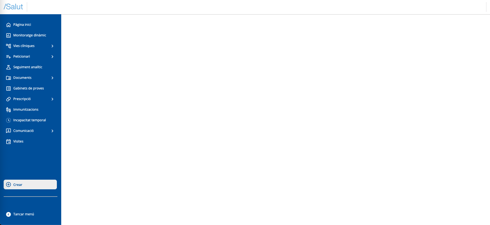
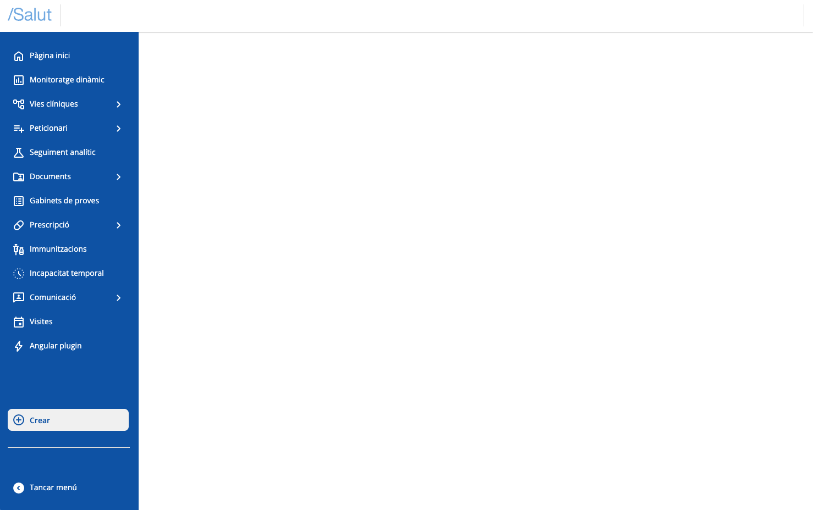

# Create a plugin

# Configure your Development Environment

Before getting started, you need to have Node.js and npm (Node's package manager) installed. You can download them from the official Node.js website.

> Note: This guide is based on Angular 18 and covers all features available in this version. However, for later versions of Angular, most of the information contained should be applicable, taking into account possible variations introduced in more recent versions. It is recommended to review the official release notes to ensure full compatibility with the version used.


# Install Angular CLI

Angular CLI is a tool that helps you create and manage Angular projects. Open your terminal or command line and install it with the following command:


```git
npm install -g @angular/cli@18
```


# Create a New Project

Once Angular CLI is installed, you can create a new project with this command:


```git
ng new your-project-name --routing=false --style=css --view-encapsulation=ShadowDom
```


It will ask us the following question:


```git
? Do you want to enable Server-Side Rendering (SSR) and Static Site Generation (SSG/Prerendering)? (y/N)
```


We will answer no, and wait for all dependencies to be installed.


# Run your Application


To see your application in action, navigate to the project directory and run:


```git
cd your-project-name
ng serve
```


This will start a local server. Open your browser and go to [`http://localhost:4200`](http://localhost:4200/) to see your new Angular application.


# Add Shell dependency

To add the "_@uxland/primary-shell"_ dependency to your project, run the following command at the root of your project:


```sql
npm install @uxland/primary-shell
```


# Initialize the Shell

When initializing the project, we have the `main.ts` file this way:


```typescript
import { bootstrapApplication } from '@angular/platform-browser';
import { appConfig } from './app/app.config';
import { AppComponent } from './app/app.component';

bootstrapApplication(AppComponent, appConfig)
  .catch((err) => console.error(err));
```


For shell initialization, we will replace the `main.ts` file we saw above with the following code:


```javascript
import { initializeShell } from "@uxland/primary-shell";
import "@uxland/primary-shell/dist/style.css"; // Add global shell and Design System styles

// Create an HTML container where we will inject the shell later
const createAndAppendSandboxApp = () => {
    const app = document.createElement("sandbox-app");
    document.body.appendChild(app);
    const sandbox = document.querySelector("sandbox-app");
    return sandbox as HTMLElement;
}
// Initialize the sandbox and the application
const initializeSandboxApp = (sandbox: HTMLElement) => {
    try {
        if (sandbox) {
            initializeShell(sandbox);
        }
    }
    catch (error) {
        console.warn(error);
    }
 }

const sandbox = createAndAppendSandboxApp();
initializeSandboxApp(sandbox);
```


Remove the "app-root" container and add the basic shell styles to the `index.html`:


```xml
<!doctype html>
<html lang="en">
<head>
  <meta charset="utf-8">
  <title>Angular plugin demo</title>
  <base href="/">
  <meta name="viewport" content="width=device-width, initial-scale=1">
  <link rel="icon" type="image/x-icon" href="favicon.ico">
</head>

<body>

</body>

<custom-style>
  <style>
    body {
      margin: 0;
      overflow: hidden;
      font-size: 14px;
      background-color: #f5f6fa;
      font-family: 'Roboto', sans-serif;
      pointer-events: auto !important;
      width: 100%;
      height: 100%;
    }
    html {
      font-size: 14px;
      overflow: hidden;
      font-family: 'Roboto', sans-serif;
      width: 100%;
      height: 100%;
    }
  </style>
</custom-style>
</html>
```


The Primary shell should be rendered in the browser.





# Generate plugin project

Harmonix plugins with Angular will really be Angular libraries. We will use Angular CLI to generate it.

```bash
ng generate library my-plugin
```
This should generate a new folder with the my-plugin code in the projects folder.


## Remove template files

Template files must be removed. We delete the `lib` folder and the `public-api` file


## Declare plugin entry file
A file must be declared where the necessary functions to declare a plugin are implemented. By convention the file is named `plugin.ts`. Then we will create the file `projects/my-plugin/src/plugin.ts`.

```javascript
import "@angular/compiler";
import { PrimariaApi } from "@uxland/primary-shell";

export const initialize = (api: PrimariaApi) => {
    console.log(`Plugin ${api.pluginInfo.pluginId} initialized`);
    return Promise.resolve();
};

export const dispose = (api: PrimariaApi) => {
    console.log(`Plugin ${api.pluginInfo.pluginId} disposed`);
    return Promise.resolve();
};
```
It is important to add the `import "@angular/compiler";` to be able to compile at runtime in the application.

In the `ng-package.json` file the library entry must be modified to _entryFile_ and remove the `dest` field.

```json
{
  "$schema": "../../node_modules/ng-packagr/ng-package.schema.json",
  "lib": {
    "entryFile": "src/plugin.ts"
  }
}
```


## Import plugins in the sandbox

### Declare the plugin import definition

We will create a file with the plugin definitions with their importers.
Here we will indicate the plugin id and its loading method.
For this, we will create the `plugins.ts` file in the src folder of the root:

```typescript
import { PluginDefinition, Plugin } from "@uxland/primary-shell";

const importer: () => Promise<Plugin> = () => import("../projects/my-plugin/src/plugin") as any;
export const plugins: PluginDefinition[] = [{ pluginId: "angular-plugin", importer: importer}]
```

This will import the plugin via the entry file (`projects/my-plugins/src/plugin`) created previously.

### Execute plugin bootstrap

We will call the plugin bootstrap function.
We will do it by calling the _bootstrapPlugins_ function in `main.ts`, passing as parameter the import definitions (`src/plugins.ts`).

```javascript
import { bootstrapPlugins, initializeShell } from "@uxland/primary-shell";
import { plugins } from "./plugins";
//...

const initializeSandboxApp = (sandbox: HTMLElement) => {
    try {
        if (sandbox) {
            initializeShell(sandbox);
            bootstrapPlugins(plugins); // Call the initialization function of all plugins
        }
    }
    catch (error) {
        console.warn(error);
    }
}

//...
```

Now we should see the console log once the plugin has loaded.


# Inject views

Now that we know the plugin is initialized correctly, we will create a component and inject it into the main region using the `regionManager` that the api provides us.


### Create view:

#### Create component
Create a component with Angular CLI
```verilog
ng generate component MainView --project my-plugin --view-encapsulation ShadowDom
```

This will generate an Angular component, with the view encapsulated in a ShadowDom, as indicated.

#### Convert to view
A folder called `views` will be created, and we will move the `main-view` component to the `views` folder.

### Create Angular application:

Unlike other frameworks like Lit, React... Angular requires an application instance, we will create the instance in the `plugin.ts`


```javascript
import { createApplication } from "@angular/platform-browser"; // Add this import
import { PrimariaApi } from "@uxland/primary-shell";

export const initialize = (api: PrimariaApi) => {
    createApplication().then(() => console.log("Angular application created")); // Add this line
    console.log(`Plugin ${api.pluginInfo.pluginId} initialized`);

    return Promise.resolve();
};
//...
```

### Create view factory:

We will create a view factory, to be able to register the main view. We will create a `factory.ts` file in the `main-view` view folder where we will declare the factory:

```typescript
import { ApplicationRef, NgZone, Type } from "@angular/core";
import { MainViewComponent } from "./main-view.component";

const viewAngularFactory = <C>(app: ApplicationRef, component: Type<C>): () => Promise<HTMLElement> => () => {
    const host = document.createElement("host-component");
    app.injector.get(NgZone).run(() => app.bootstrap(component, host));
    return Promise.resolve(host);
  }

  export const viewFactory = (app:ApplicationRef)  => viewAngularFactory(app, MainViewComponent);
```

## Inject the view to the main region

Then, on one hand we will register a view to the main region and on the other hand we will do the same to the navigation region.

To do this, we will use the `regionManager` that the api provides us.

We will use the `registerMainView` method of the `regionManager` passing it the view factory.

We will also change the dispose function so it removes the view when the plugin is deactivated. To do this we will access the shell regions that the api gives us and use the main region. As the second argument we will pass the id of the view we want to remove. Since we will want to remove the view registered with the `registerMainView` function, we will pass it that same id:


```typescript
import { createApplication } from "@angular/platform-browser";
import { PrimariaApi } from "@uxland/primary-shell";
import { viewFactory } from "./views/main-view/factory";

export const initialize = (api: PrimariaApi) => {
    createApplication().then((app) => {
        api.regionManager.registerMainView({
          id: "plugin-main-view", // Here we declare the view id
          factory: viewFactory(app),
        }); //Register the view to the main region with the declared factory
      });
    return Promise.resolve();
};

export const dispose = (api: PrimariaApi) => {
  const main = api.regionManager.regions.shell.main;
  api.regionManager.removeView(main, "plugin-main-view"); // Here we use the id of the main view we want to remove
  return Promise.resolve();
}
```

### Other view injection examples: navigation menu

To add a plugin view in the side navigation menu we will use the registerView method of the `regionManager`. In this case, we will pass the factory an instance of the `PrimariaNavItem` class imported from the shell (_@uxland/primary-shell_), at the same time, we will pass it a configuration object that will have the "icon" property with the icon literal to display, "label" with the title that will be displayed in the menu and "callbackFn" with the callback that will activate the view registered in main when clicking the menu item:


```typescript
//...
import { PrimariaApi, PrimariaNavItem } from "@uxland/primary-shell";

export const initialize = (api: PrimariaApi) => {
  //...
    const navigationMenu = api.regionManager.regions.shell.navigationMenu;
    api.regionManager.registerView(navigationMenu,{
            id: "plugin-navigation-menu",
            factory: () => {
              const menuItem = new PrimariaNavItem({
                icon: "bolt",
                label: "Angular plugin",
                callbackFn: () => {
                  api.regionManager.activateMainView("plugin-main-view");
                },
              });
              return Promise.resolve(menuItem);
            },
          });
    //...
};

//...
```

At this point, in the browser we will see the following:




At this point, if integration with any part of the Clinical Follow-up plugin is needed, it will be required to add the compiled plugin file in the Sandbox. To include it, the plugin import must be added to the `plugins.ts` file. This import can be obtained directly from the demo repository shown at the end.
This way, the view that would be displayed if the Clinical Follow-up plugin is incorporated would be the following:


And when clicking the "Angular plugin" button, we will see our plugin working and displayed in the main region:


Congratulations, you have implemented your first plugin in Harmonix!

You can see an example repository where a plugin is implemented with Angular:

[https://stackblitz.com/~/github.com/uxland/harmonix-angular-plugin-demo](https://stackblitz.com/~/github.com/uxland/harmonix-angular-plugin-demo)
