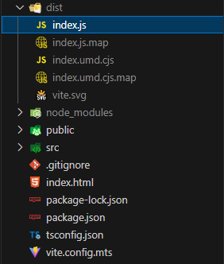

## Compilació plugin

# Configuració vite

<br/>

La configuració de l'arxiu `vite.config.ts` defineix com a externes les dependències "lit" i "@uxland/primary-shell", indicant que no s'han d'incloure en el paquet final. I s'inclou la definició de `inlineDynamicImports: true`, que força a incloure totes les importacions dinàmiques en un únic arxiu.
Això és necessari per evitar la duplicitat de dependències grans o comunes en el paquet i reduïr el tamany de l'arxiu final, assegurant que els plugins comparteixin aquestes dependències en comptes d'incloure-les per duplicat. D'aquesta manera es té un sol arxiu de sortida.

A aquest últim concepte d'unitat d'arxiu, també s'hi suma la definició de `manualChunks: undefined`, que en establir-se com a _undefined_, el que es fa és desactivar la funcionalitat de dividir els mòduls en diferents fragments.

<br/>

# Build per producció

Una vegada es té el plugin finalitzat, s'ha de preparar per a poder-lo desplegar a la Plugin Store.
Per generar el paquet final del plugin, s'han d'executar aquestes dues comandes següents:

<br/>

```bash
npm install
npm run vite build
```

<br/>

Seguidament es crea automàticament la carpeta _dist_. Dins aquesta carpeta, l'arxiu `index.js` és el que s'haurà de pujar a la Plugin Store.

<br/>



<br/>


