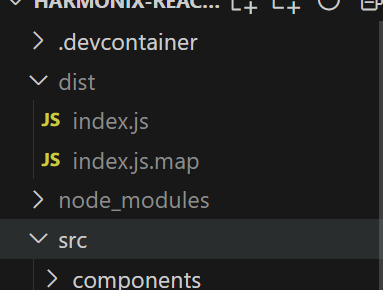

# Plugin compilation

# Vite configuration

<br/>

The configuration of the `vite.config.ts` file defines as external the dependencies "lit" and "@uxland/primary-shell", indicating that they should not be included in the final package. And the definition of `inlineDynamicImports: true` is included, which forces to include all dynamic imports in a single file.
This is necessary to avoid duplication of large or common dependencies in the package and reduce the size of the final file, ensuring that plugins share these dependencies instead of including them duplicated. This way you have a single output file:

```typescript
import { defineConfig, loadEnv } from "vite";
import pkg from "./package.json";
export default ({ mode }) => {
  process.env = { ...process.env, ...loadEnv(mode, process.cwd()) };

  return defineConfig({
    define: {
      "process.env": {},
    },
    build: {
      lib: {
        entry: "./src/plugin.ts",
        fileName: "index",
        name: pkg.name,
      },

      rollupOptions: {
        external: ["lit", "@uxland/primary-shell"],
        output: {
          globals: {
            lit: "lit",
            "@uxland/primary-shell": "@uxland/primary-shell",
          },
          inlineDynamicImports: true,
          manualChunks: undefined,
        },
      },
      minify: true,
      sourcemap: true,
    },
  });
};
```

To this last concept of file unit, we also add the definition of `manualChunks: undefined`, which when set as _undefined_, what it does is disable the functionality of dividing modules into different fragments.

<br/>

# Production build

Once the plugin is finished, it must be prepared to be deployed to the Plugin Store.
To generate the final plugin package, these two following commands must be executed:

<br/>

```bash
npm install
npm run vite build
```

<br/>

Next, the _dist_ folder is automatically created. Inside this folder, the `index.js` file is the one that must be uploaded to the Plugin Store.





<br/>
