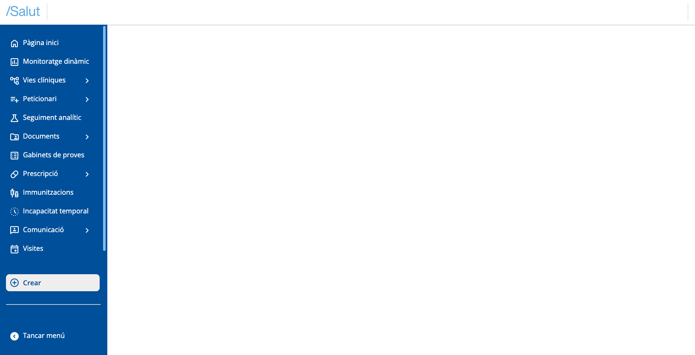
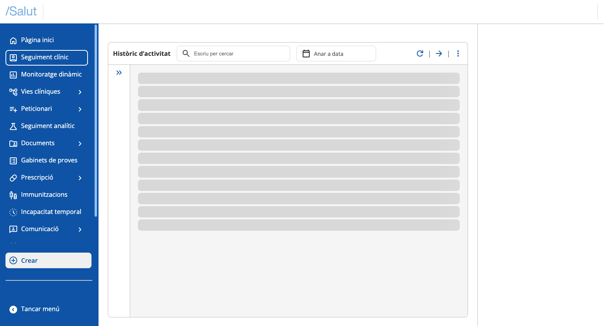
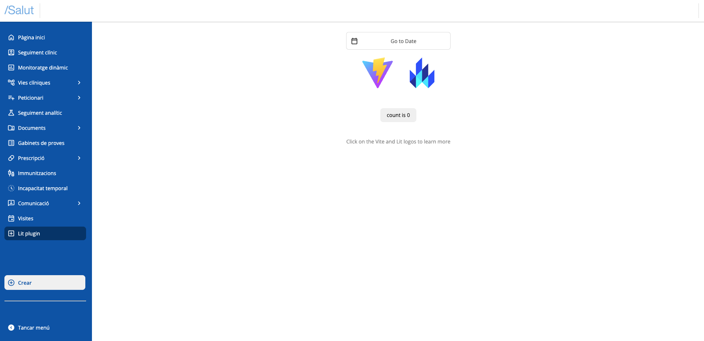

# Crear un plugin

# Configura el teu Entorn de Desenvolupament

Abans de començar, necessites tenir instal·lat Node.js i npm (el gestor de paquets de Node). Pots descarregar-los des de la pàgina oficial de Node.js.


# Crea un Nou Projecte

Un cop instal·lat Node, pots crear un nou projecte. Recomanem utilitzar Vite i TypeScript fent servir, per exemple, aquesta comanda:

  

```git
npm create vite@latest lit-plugin-demo -- --template lit-ts
```

  

Segueix les instruccions en pantalla per a configurar el teu projecte.


# Executa la teva Aplicació

Per veure la teva aplicació en acció, navega al directori del teu projecte i executa:

  

```git
cd nom-del-teu-projecte
npm install
npm run dev
```

  

Això iniciarà un servidor local. Obre el teu navegador i dirigeix-te a [`http://localhost:5173`](http://localhost:5173/) (port per defecte de Vite) per veure la teva nova aplicació Lit.


# Edita la teva Aplicació

Pots començar per editar la teva aplicació obrint el directori del teu projecte en el teu editor de codi favorit.

  

*   Substitueix regles d'estil de l'arxiu `index.css` per les següents:

```css
body {
  margin: 0;
  overflow: hidden;
  font-size: 14px;
  background-color: #f5f6fa;
  font-family: 'Roboto', sans-serif;
  pointer-events: auto !important;
  width: 100%;
  height: 100%;
}

html {
  font-size: 14px;
  overflow: hidden;
  font-family: 'Roboto', sans-serif;
  width: 100%;
  height: 100%;
}
```

*   Crea un arxiu `sandbox.ts` a la carpeta src del projecte
*   Importa aquest arxiu `sandbox.ts` en el teu `index.html` com script d'entrada. Per a això modifica la ruta de la següent línia per la del sandbox:

```xml
  <script type="module" src="/src/my-element.ts"></script>
```

*   Al `index.html` elimina les següents línies:

  

```html
<my-element>
  <h1>Vite + Lit</h1>
</my-element>
```


# Afegir dependència al Shell

Per a afegir la dependència _@uxland/primary-shell_ al teu projecte, executa la següent comanda en l'arrel del teu projecte:

  

```bash
npm install @uxland/primary-shell
```


# Inicialitzar el Shell

A l'arxiu `sandbox.ts` li afegirem el següent codi, on crearem un element app, l'inserirem al body i cridarem a la funció _initializeSandboxApp_ passant l'element creat. Caldrà també importar l'arxiu dels estils.

```javascript
import { initializeShell } from "@uxland/primary-shell";
import "@uxland/primary-shell/dist/style.css"; // Afegim els estils globals del shell i el Design System

// Creem un contenidor HTML on injectarem el shell més endavant
const createAndAppendSandboxApp = () => {
  const app = document.createElement("sandbox-app");
  document.body.appendChild(app);
  const sandbox = document.querySelector("sandbox-app");
  return sandbox as HTMLElement;
}
// Inicialitzem el sandbox i l'aplicació
const initializeSandboxApp = (sandbox: HTMLElement) => {
  try {
    if (sandbox) {
        initializeShell(sandbox);
      }
    }
    catch (error) {
      console.warn(error);
    }
 }

const app = createAndAppendSandboxApp();
initializeSandboxApp(app);
```

  

Hauries de veure renderitzat el Shell de primària en el navegador:

  




# Declarar arxiu d'entrada plugin

S'ha de declarar un arxiu on s'implementin les funcions necessàries per a inicialitzar un plugin.

En aquest exemple crearem l'arxiu `plugin.ts` a la carpeta src amb el següent contingut:

  

```javascript
import { PrimariaApi } from "@uxland/primary-shell";

export const initialize = (api: PrimariaApi) => {
    console.log(`Plugin ${api.pluginInfo.pluginId} initialized`);
    return Promise.resolve();
};
export const dispose = (api: PrimariaApi) => {
    console.log(`Plugin ${api.pluginInfo.pluginId} disposed`);
    Promise.resolve();
}
```


# Declarar una col·lecció de plugins

S'ha de declarar cada plugin que es vulgui inicialitzar en el shell. Per a això, podem crear un arxiu `plugins.ts` on exportarem l'array de les definicions dels plugins. A cada element l'indicarem l'id i una funció per a importar-ho. Exemple:

  

```coffeescript
import { PluginDefinition, Plugin } from "@uxland/primary-shell";

const importer: () => Promise<Plugin> = () => import("./plugin") as any;

export const plugins: PluginDefinition[] = [{ pluginId: "lit-plugin", importer: importer }];
```

  

Ara s'ha d'indicar al shell que inicialitzi els plugins en el procés d'inicialització de l'app de l'arxiu `sandbox.ts` anterior. Per a això, utilitzarem la funció _bootstrapPlugins_ passant-li la col·lecció de plugins que hem creat abans_._

L'arxiu quedaria d'aquesta manera:

  

```javascript
import { bootstrapPlugins, initializeShell } from "@uxland/primary-shell";
import { plugins } from "./plugins"
import "@uxland/primary-shell/dist/style.css";

const createAndAppendSandboxApp= () => {
  const app = document.createElement("sandbox-app");
  document.body.appendChild(app);
  const sandbox = document.querySelector("sandbox-app");
  return sandbox as HTMLElement;
};

const initializeSandboxApp = (sandbox: HTMLElement) => {
  try {
    if (sandbox) {
        initializeShell(sandbox);
        bootstrapPlugins(plugins); // Cridem a la funció de inicialització de tots els plugins
      }
    }
    catch (error) {
      console.warn(error);
    }
 }

const app = createAndAppendSandboxApp();
initializeSandboxApp(app);
```

  

Després d'aquests passos, ja podries veure en consola el missatge que has escrit a la funció _initializeSandboxApp_.

  


# Injectar el plugin a les vistes

Una vegada hem creat el plugin, ja podem registrar les vistes. Registrarem una vista a la regió del menú lateral de navegació.

Per a això, utilitzarem el `regionManager` que ens proporciona l'api i els seus mètodes `registerMainView` i `registerNavigationMenu` per escollir en quina regió injectar-los:

  

*   Utilitzarem el mètode `registerMainView` del `regionManager` passant-li la vista. En aquest cas aprofitarem el component _MyElement_ del boilerplate de Vite com a exemple. L'arxiu `plugin.ts`:

  

```javascript
import { PrimariaApi } from "@uxland/primary-shell";
import { MyElement } from "./my-element";

export const initialize = (api: PrimariaApi) => {
  console.log(`Plugin ${api.pluginInfo.pluginId} initialized`);
  api.regionManager.registerMainView({
    id: "plugin-main-view", // Aquí declarem la id de la vista
    factory: () =>  Promise.resolve(new MyElement()) ,
  });
  
  return Promise.resolve();
};
export const dispose = (api: PrimariaApi) => {
  console.log(`Plugin ${api.pluginInfo.pluginId} disposed`);
  return Promise.resolve();
}
```

*   Canviarem també la funció dispose per a que elimini la vista quan es desactivi el plugin. Per a això importarem `shellRegions` de "_@uxland/primary-shell_" que ens donarà les regions del shell i utilitzarem la regió main, que és on hem registrat la vista prèviament. Com a segon argument, li passarem l'id de la vista que volem eliminar. Com que voldrem eliminar la vista registrada amb la funció `registerMainView`, li passarem aquella mateixa id:

```javascript
import { PrimariaApi, shellRegions } from "@uxland/primary-shell";
import { MyElement } from "./my-element";

export const initialize = (api: PrimariaApi) => {
  console.log(`Plugin ${api.pluginInfo.pluginId} initialized`);
  api.regionManager.registerMainView({
    id: "plugin-main-view", // Aquí declarem la id de la vista
    factory: () =>  Promise.resolve(new MyElement()) ,
  }); 
  
  return Promise.resolve();
};
export const dispose = (api: PrimariaApi) => {
  console.log(`Plugin ${api.pluginInfo.pluginId} disposed`);
```

  

```javascript
  api.regionManager.removeView(shellRegions.main, "plugin-main-view"); //Aquí utilitzarem la id de la vista del main que volem eliminar
  return Promise.resolve();
}
```

  

*   Per a afegir el plugin en el menú lateral, utilitzarem el mètode `registerNavigationMenu` del `regionManager`. En aquest cas, a la factoria li passarem una instància de la classe `PrimariaNavItem` importada del shell (_@uxland/primary-shell_), i a la mateixa vegada, li passarem un objecte de configuració que tindrá la propietat "icon" amb el literal de la icona a mostrar, "label" amb el títol que es mostrarà en el menú i "callbackFn" amb la callback que activarà la vista registrada en main al clicar l'ítem del menú:

```typescript
import { PrimariaApi, PrimariaMenuItem, shellRegions } from "@uxland/primary-shell";
import { MyElement } from "./my-element";

export const initialize = (api: PrimariaApi) => {
  console.log(`Plugin ${api.pluginInfo.pluginId} initialized`);
  api.regionManager.registerMainView({
    id: "plugin-main-view",
    factory: () =>  Promise.resolve(new MyElement()) ,
  },);
  
  api.regionManager.registerView(shellRegions.navigationMenu,{
    id: "plugin-sidebar",
    factory: () => {
      const menuItem = new PrimariaNavItem({
        icon: "add_box",
        label: "Lit plugin",
        callbackFn: () => {
          api.regionManager.activateMainView("plugin-main-view")
        },
      });
      return Promise.resolve(menuItem);
    },
  });
  return Promise.resolve();
};
export const dispose = (api: PrimariaApi) => {
  console.log(`Plugin ${api.pluginInfo.pluginId} disposed`);
  api.regionManager.removeView(shellRegions.main, "plugin-main-view"); // Aquí utilitzarem la id de la vista del main que volem eliminar
api.regionManager.removeView(shellRegions.navigationMenu, "plugin-sidebar");
  return Promise.resolve();
}
```


Arribats a aquest punt, en el navegador veurem el següent:

  


  

I quan fem click sobre el botó "Lit plugin" del menú ràpid, veurem el nostre plugin funcionant i mostrat a la regió principal:

  



  

Enhorabona, has implementat el teu primer plugin a Harmonix!

Si vols veure el resultat d'aquesta configuració i creació d'un plugin d'Harmonix amb Lit, aquí es mostra una demo del repositori:

[https://stackblitz.com/~/github.com/uxland/harmonix-lit-plugin-demo](https://stackblitz.com/~/github.com/uxland/harmonix-lit-plugin-demo)