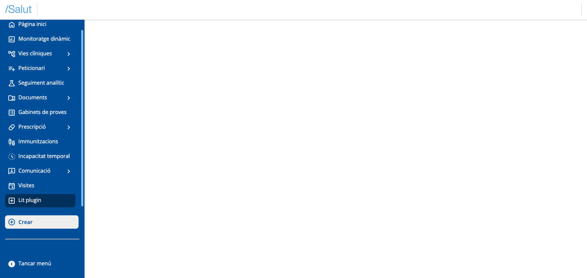
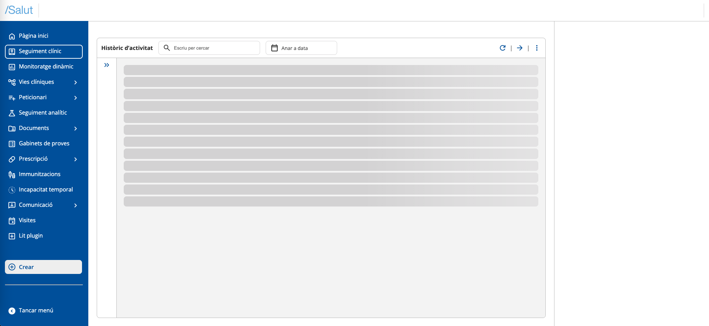

# Create a plugin

# Configure your Development Environment

Before getting started, you need to have Node.js and npm (Node's package manager) installed. You can download them from the official Node.js website.


# Create a New Project

Once Node is installed, you can create a new project. We recommend using Vite and TypeScript using, for example, this command:


```git
npm create vite@latest lit-plugin-demo -- --template lit-ts
```


Follow the on-screen instructions to configure your project.


# Run your Application

To see your application in action, navigate to your project directory and run:


```git
cd your-project-name
npm install
npm run dev
```


This will start a local server. Open your browser and go to [`http://localhost:5173`](http://localhost:5173/) (default Vite port) to see your new Lit application.


# Edit your Application

You can start by editing your application by opening your project directory in your favorite code editor.


*   Replace the style rules in the `index.css` file with the following:

```css
body {
  margin: 0;
  overflow: hidden;
  font-size: 14px;
  background-color: #f5f6fa;
  font-family: 'Roboto', sans-serif;
  pointer-events: auto !important;
  width: 100%;
  height: 100%;
}

html {
  font-size: 14px;
  overflow: hidden;
  font-family: 'Roboto', sans-serif;
  width: 100%;
  height: 100%;
}
```

*   Create a `sandbox.ts` file in the src folder of the project
*   Import this `sandbox.ts` file in your `index.html` as an entry script. To do this, modify the path of the following line to that of the sandbox:

```xml
  <script type="module" src="/src/my-element.ts"></script>
```

*   In the `index.html` remove the following lines:


```html
<my-element>
  <h1>Vite + Lit</h1>
</my-element>
```


# Add Shell dependency

To add the _@uxland/primary-shell_ dependency to your project, run the following command at the root of your project:


```bash
npm install @uxland/primary-shell
```


# Initialize the Shell

In the `sandbox.ts` file we will add the following code, where we will create an app element, insert it in the body and call the _initializeSandboxApp_ function passing the created element. The styles file will also need to be imported.

```javascript
import { initializeShell } from "@uxland/primary-shell";
import "@uxland/primary-shell/dist/style.css"; // Add global shell and Design System styles

// Create an HTML container where we will inject the shell later
const createAndAppendSandboxApp = () => {
  const app = document.createElement("sandbox-app");
  document.body.appendChild(app);
  const sandbox = document.querySelector("sandbox-app");
  return sandbox as HTMLElement;
}
// Initialize the sandbox and the application
const initializeSandboxApp = (sandbox: HTMLElement) => {
  try {
    if (sandbox) {
        initializeShell(sandbox);
      }
    }
    catch (error) {
      console.warn(error);
    }
 }

const app = createAndAppendSandboxApp();
initializeSandboxApp(app);
```


You should see the Primary shell rendered in the browser:


# Declare plugin entry file

A file must be declared where the necessary functions to initialize a plugin are implemented.

In this example we will create the `plugin.ts` file in the src folder with the following content:


```javascript
import { PrimariaApi } from "@uxland/primary-shell";

export const initialize = (api: PrimariaApi) => {
    console.log(`Plugin ${api.pluginInfo.pluginId} initialized`);
    return Promise.resolve();
};
export const dispose = (api: PrimariaApi) => {
    console.log(`Plugin ${api.pluginInfo.pluginId} disposed`);
    Promise.resolve();
}
```


# Declare a plugin collection

Each plugin that you want to initialize in the shell must be declared. To do this, we can create a `plugins.ts` file where we will export the array of plugin definitions. For each element we will indicate the id and a function to import it. Example:


```coffeescript
import { PluginDefinition, Plugin } from "@uxland/primary-shell";

const importer: () => Promise<Plugin> = () => import("./plugin") as any;

export const plugins: PluginDefinition[] = [{ pluginId: "lit-plugin", importer: importer }];
```


Now you must tell the shell to initialize the plugins in the app initialization process of the previous `sandbox.ts` file. To do this, we will use the _bootstrapPlugins_ function passing it the plugin collection we created before_._

The file would look like this:


```javascript
import { bootstrapPlugins, initializeShell } from "@uxland/primary-shell";
import { plugins } from "./plugins"
import "@uxland/primary-shell/dist/style.css";

const createAndAppendSandboxApp= () => {
  const app = document.createElement("sandbox-app");
  document.body.appendChild(app);
  const sandbox = document.querySelector("sandbox-app");
  return sandbox as HTMLElement;
};

const initializeSandboxApp = (sandbox: HTMLElement) => {
  try {
    if (sandbox) {
        initializeShell(sandbox);
        bootstrapPlugins(plugins); // Call the initialization function of all plugins
      }
    }
    catch (error) {
      console.warn(error);
    }
 }

const app = createAndAppendSandboxApp();
initializeSandboxApp(app);
```


After these steps, you should already be able to see in the console the message you wrote in the _initializeSandboxApp_ function.


# Inject the plugin to the views

Once we have created the plugin, we can now register the views. We will register a view to the side navigation menu region.

To do this, we will use the `regionManager` that the api provides us and its `registerMainView` and `registerNavigationMenu` methods to choose which region to inject them to:


*   We will use the `registerMainView` method of the `regionManager` passing it the view. In this case we will take advantage of the _MyElement_ component from the Vite boilerplate as an example. The `plugin.ts` file:


```javascript
import { PrimariaApi } from "@uxland/primary-shell";
import { MyElement } from "./my-element";

export const initialize = (api: PrimariaApi) => {
  console.log(`Plugin ${api.pluginInfo.pluginId} initialized`);
  api.regionManager.registerMainView({
    id: "plugin-main-view", // Here we declare the view id
    factory: () =>  Promise.resolve(new MyElement()) ,
  });

  return Promise.resolve();
};
export const dispose = (api: PrimariaApi) => {
  console.log(`Plugin ${api.pluginInfo.pluginId} disposed`);
  return Promise.resolve();
}
```

*   We will also change the dispose function so it removes the view when the plugin is deactivated. To do this we will access the "main" region that the api gives us, which is where we previously registered the view. As the second argument, we will pass the id of the view we want to remove. Since we will want to remove the view registered with the `registerMainView` function, we will pass it that same id:

```javascript
import { PrimariaApi } from "@uxland/primary-shell";
import { MyElement } from "./my-element";

export const initialize = (api: PrimariaApi) => {
  console.log(`Plugin ${api.pluginInfo.pluginId} initialized`);
  api.regionManager.registerMainView({
    id: "plugin-main-view", // Here we declare the view id
    factory: () =>  Promise.resolve(new MyElement()) ,
  });

  return Promise.resolve();
};
export const dispose = (api: PrimariaApi) => {
  console.log(`Plugin ${api.pluginInfo.pluginId} disposed`);
  const main = api.regionManager.regions.shell.main;
  api.regionManager.removeView(main, "plugin-main-view"); //Here we will use the id of the main view we want to remove
  return Promise.resolve();
}
```


*   To add the plugin to the side menu, we will use the `registerView` method of the `regionManager`, which is specified the region (`navigationMenu`). In this case, we will pass the factory an instance of the `PrimariaNavItem` class imported from the shell (_@uxland/primary-shell_), and at the same time, we will pass it a configuration object that will have the "icon" property with the icon literal to display, "label" with the title that will be displayed in the menu and "callbackFn" with the callback that will activate the view registered in main when clicking the menu item:

```typescript
import { PrimariaApi, PrimariaNavItem } from "@uxland/primary-shell";
import { MyElement } from "./my-element";

export const initialize = (api: PrimariaApi) => {
  console.log(`Plugin ${api.pluginInfo.pluginId} initialized`);
  api.regionManager.registerMainView({
    id: "plugin-main-view",
    factory: () =>  Promise.resolve(new MyElement()) ,
  },);

  const navigationMenu = api.regionManager.regions.shell.navigationMenu
  api.regionManager.registerView(navigationMenu,{
    id: "plugin-sidebar",
    factory: () => {
      const menuItem = new PrimariaNavItem({
        icon: "add_box",
        label: "Lit plugin",
        callbackFn: () => {
          api.regionManager.activateMainView("plugin-main-view")
        },
      });
      return Promise.resolve(menuItem);
    },
  });
  return Promise.resolve();
};
export const dispose = (api: PrimariaApi) => {
  console.log(`Plugin ${api.pluginInfo.pluginId} disposed`);
  const main = api.regionManager.regions.shell.main;
  api.regionManager.removeView(main, "plugin-main-view"); // Here we will use the id of the main view we want to remove
  const navigationMenu = api.regionManager.regions.shell.navigationMenu;
  api.regionManager.removeView(navigationMenu, "plugin-sidebar");
  return Promise.resolve();
}
```


At this point, in the browser we will see the following:




At this point, if integration with any part of the Clinical Follow-up plugin is needed, it will be required to add the compiled plugin file in the Sandbox. To include it, the plugin import must be added to the `plugins.ts` file. This import can be obtained directly from the demo repository shown at the end.
This way, the view that would be displayed if the Clinical Follow-up plugin is incorporated would be the following:




And when we click on the "Lit plugin" button in the quick menu, we will see our plugin working and displayed in the main region:


Congratulations, you have implemented your first plugin in Harmonix!

If you want to see the result of this configuration and creation of a Harmonix plugin with Lit, here is a demo of the repository:

[https://stackblitz.com/~/github.com/uxland/harmonix-lit-plugin-demo](https://stackblitz.com/~/github.com/uxland/harmonix-lit-plugin-demo)
