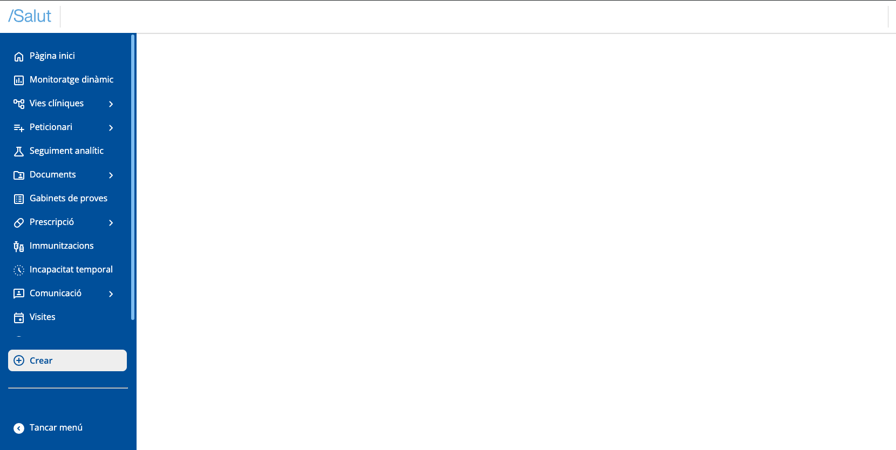
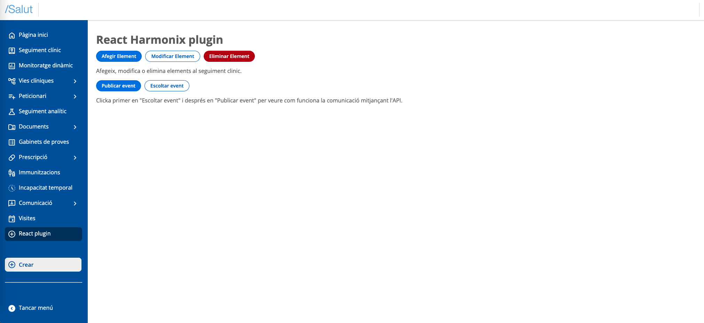

# Create a plugin

# Configure your Development Environment

Initially, you need to have Node.js and npm (Node's package manager) installed. You can download them from the official Node.js website.


# Create a New Project

Once Node is installed, you can create a new project. We recommend using Vite and TypeScript using, for example, this command:


```bash
npm create vite@latest react-plugin-demo -- --template react-ts
```


Follow the on-screen instructions to configure your project.


# Run your Application

To see your application in action, navigate to your project directory and run:


```bash
cd your-project-name
npm install
npm run dev
```


This will start a local server. Open your browser and go to [`http://localhost:5173`](http://localhost:5173/) (default Vite port) to see your new Lit application.


# Prepare your application before editing

Before moving on to editing the application, we recommend having a minimum file and folder structure established initially, so that it is easier and simpler to edit the application files later. So you can delete the `App.css`, `App.tsx` and `main.tsx` files that are created by default. An example would be the following:


In this example a folder is created for components, and a folder for the views to be registered to the shell (in this example two, one for the header region and the other for the main region). The `plugin.ts`, `plugins.ts` and `sandbox.ts` files are created in the next steps.


# Edit your application

You can start by editing your application by opening your project directory in your favorite code editor.


*   Replace the style rules in the `index.css` file with the following:

```css
body {
  margin: 0;
  overflow: hidden;
  font-size: 14px;
  background-color: #f5f6fa;
  font-family: 'Roboto', sans-serif;
  pointer-events: auto !important;
  width: 100%;
  height: 100%;
}

html {
  font-size: 14px;
  overflow: hidden;
  font-family: 'Roboto', sans-serif;
  width: 100%;
  height: 100%;
}
```

And then link this `index.css` file to the head of your `index.html` file:

```css
  <link rel="stylesheet" href="./src/index.css" />
```


*   Create a `sandbox.ts` file in the src folder of the project
*   Import this `sandbox.ts` file in your `index.html` as an entry script. To do this, modify the path of the following line to that of the sandbox:

```xml
  <script type="module" src="/src/main.tsx"></script>
```

*   In the `index.html`, inside the _body_ tag you can remove the following:


```html
<div id="root"></div>
```


# Add Shell dependency

To add the _@uxland/primary-shell_ dependency to your project, run the following command at the root of your project:


```bash
npm install @uxland/primary-shell
```


# Initialize the Shell

In the `sandbox.ts` file we will add the following code, where we will create an app element, insert it in the body and call the _initializeSandboxApp_ function passing the created element. The styles file will also need to be imported.

```javascript
import { initializeShell } from "@uxland/primary-shell";
import "@uxland/primary-shell/dist/style.css"; // Add global shell and Design System styles

// Create an HTML container where we will inject the shell later
const createAndAppendSandboxApp = () => {
  const app = document.createElement("sandbox-app");
  document.body.appendChild(app);
  const sandbox = document.querySelector("sandbox-app");
  return sandbox as HTMLElement;
}
// Initialize the sandbox and the application
const initializeSandboxApp = (sandbox: HTMLElement) => {
  try {
    if (sandbox) {
        initializeShell(sandbox);
      }
    }
    catch (error) {
      console.warn(error);
    }
 }

const app = createAndAppendSandboxApp();
initializeSandboxApp(app);
```


You should see the Primary shell rendered in the browser:





# Declare plugin entry file

A file must be declared where the necessary functions to initialize a plugin are implemented.

In this example we will create the `plugin.ts` file in the src folder with the following content:


```javascript
import { PrimariaApi } from "@uxland/primary-shell";

export const initialize = (api: PrimariaApi) => {
    console.log(`Plugin ${api.pluginInfo.pluginId} initialized`);
    return Promise.resolve();
};
export const dispose = (api: PrimariaApi) => {
    console.log(`Plugin ${api.pluginInfo.pluginId} disposed`);
    Promise.resolve();
}
```


# Declare a plugin collection

Each plugin that you want to initialize in the shell must be declared. To do this, we can create a `plugins.ts` file where we will export the array of plugin definitions. For each element we will indicate the id and a function to import it. Example:


```coffeescript
import { PluginDefinition, Plugin } from "@uxland/primary-shell";

const importer: () => Promise<Plugin> = () => import("./plugin") as any;

export const plugins: PluginDefinition[] = [{ pluginId: "react-plugin", importer: importer }];
```


Now you must tell the shell to initialize the plugins in the app initialization process of the previous `sandbox.ts` file. To do this, we will use the _bootstrapPlugins_ function passing it the plugin collection we created before_._

The file would look like this:


```javascript
import { bootstrapPlugins, initializeShell } from "@uxland/primary-shell";
import { plugins } from "./plugins"
import "@uxland/primary-shell/dist/style.css";

const createAndAppendSandboxApp= () => {
  const app = document.createElement("sandbox-app");
  document.body.appendChild(app);
  const sandbox = document.querySelector("sandbox-app");
  return sandbox as HTMLElement;
};

const initializeSandboxApp = (sandbox: HTMLElement) => {
  try {
    if (sandbox) {
        initializeShell(sandbox);
        bootstrapPlugins(plugins); // Call the initialization function of all plugins
      }
    }
    catch (error) {
      console.warn(error);
    }
 }

const app = createAndAppendSandboxApp();
initializeSandboxApp(app);
```


After these steps, you should already be able to see in the console the message you wrote in the _initializeSandboxApp_ function.


# Prepare and adapt the views

A previous and very important step before being able to inject the plugin into the regions is the creation of the 3 files that each folder must have for its corresponding view. As shown above, in this example we have two views (_header_ and _main_). For each view, inside its corresponding folder we will create a `factory.ts` file, a `styles.css` and a `view.tsx`.


The `factory.ts` file declares the view creation factory function.

The `view.tsx` file declares the root component of the view.

The `styles.css` file declares all styles of the view components.


The _"@uxland/primary-shell"_ contains a utility function _wrapReactViewFactory_ that facilitates the creation of React functional component view factories, wrapping the React component with styles in a WebComponent.


In the case of the HeaderView we would create the `factory.ts` file:


```javascript
import { wrapReactViewFactory } from "@uxland/primary-shell";
import styles from "./styles.css?inline";
import { HeaderView } from "./view";

export const headerFactory = wrapReactViewFactory(HeaderView, styles);
```


The `view.tsx` file with the react functional component of the view:

```typescript
export const HeaderView = () => {
  return (
      <div>
        <div className="title">
            React Harmonix plugin
        </div>
      </div>
  );
}
```


And the `styles.css` file then will be the style we apply to our view:


```css
.title {
    color: purple;
    background: orange;
    padding: 5px;
    border-radius: 10px;
    border: 1px solid purple;
}

```


Important: in cases where the component that acts as a view has other child components internally, the styles of the child components must be explicitly imported for correct operation.


For example, in the case of one of the views of this example (_MainView_), the _MainView_ component looks like this, in which it internally has the _CounterButton_ child component:


```typescript
import React from 'react';
import {CounterButton} from "../../components/counter-button/counter-button";

export const MainView = () => {

const [count, setCount] = React.useState(0);
const increment = () => setCount(count + 1);
const decrement = () => setCount(count - 1);

  return (
    <>
      <h1>React Harmonix plugin</h1>
      <h2>Counter: {count}</h2>
      <CounterButton onClick={increment}>Increment</CounterButton>
      <CounterButton onClick={decrement}>Decrement</CounterButton>
      <h1>Hello, world!</h1>
      <p>This is a basic functional component in React within a Web Component.</p>
    </>
  );
};
```


This means that its corresponding `styles.css` file in addition to including the styles of the parent component (_MainView_), must also directly import the styles of the child component (_CounterButton_):


```css
@import "../../components/counter-button/counter-button.css";

h1{
    color: blue;
}
```
NOTE: in case a height and min-height of 100% is needed for the view, it can be specified with the "fullHeight" parameter. This is how the `factory.ts` file would look:

```typescript
import { wrapReactViewFactory } from "@uxland/primary-shell";
import { MainView } from "./view";
import styles from "./styles.css?inline";

export const mainFactory = wrapReactViewFactory(MainView, styles, { fullHeight: true });
```


The mentioned _CounterButton_ component would have its following `counter-button.tsx` file:

```typescript
import react, { ReactNode } from "react";
export const CounterButton: react.FC<{children: ReactNode, onClick: () => void}> = ({children, onClick}) => {
      return (
        <button className="btn-counter" onClick={onClick}>
            {children}
        </button>
      );
    };
```

And its following `counter-button.css` styles file:

```css
.btn-counter {
    background-color: #6a0dad;
    color: white;
    border: none;
    padding: 12px 24px;
    border-radius: 5px;
    font-size: 16px;
    cursor: pointer;
    transition: background-color 0.3s, transform 0.1s;
    margin: 10px;
  }

  .btn-counter:hover {
    background-color: #8a2be2;
  }

  .btn-counter:active {
    transform: scale(0.95);
    background-color: #5b0e94;
  }
```


# Inject the plugin to the views

Once we have created the plugin and prepared the views, we can now register them. We will register a view to the main region with its corresponding action in the side menu.

To do this, we will use the `regionManager` that the api provides us and its `registerMainView` method to register directly to the region or the registerView method where we will have to pass it the Shell region where we want to register them:


*   We will use the `registerMainView` method passing it the view, in the `plugin.ts` file:


```typescript
import { PrimariaApi } from "@uxland/primary-shell";
import { mainFactory } from "./views/main/factory";

export const initialize = (api: PrimariaApi) => {
  console.log(`Plugin ${api.pluginInfo.pluginId} initialized`);
  api.regionManager.registerMainView({
    id: "plugin-main-view", // Here we declare the view id
    factory: ()=> mainFactory({api})
  },);
};
export const dispose = (api: PrimariaApi) => {
  console.log(`Plugin ${api.pluginInfo.pluginId} disposed`);
  return Promise.resolve();
}
```


*   We will also change the dispose function so it removes the view when the plugin is deactivated. To do this we will access the "main" region that the api gives us, which is where we previously registered the view. As the second argument, we will pass the id of the view we want to remove. Since we will want to remove the view registered with the `registerMainView` function, we will pass it that same id:


```typescript
import { PrimariaApi } from "@uxland/primary-shell";
import { mainFactory } from "./views/main/factory";
import { headerFactory } from "./views/header/factory";

export const initialize = (api: PrimariaApi) => {
  console.log(`Plugin ${api.pluginInfo.pluginId} initialized`);
  api.regionManager.registerMainView({
    id: "plugin-main-view",
    factory: mainFactory
  },);
};
export const dispose = (api: PrimariaApi) => {
  console.log(`Plugin ${api.pluginInfo.pluginId} disposed`);
  const mainRegion = api.regionManager.regions.shell.main;
  api.regionManager.removeView(mainRegion, "plugin-main-view"); //Here we will use the id of the main view we want to remove
  return Promise.resolve();
}
```


*   To add the plugin to the side menu, we will use the `registerView` method of the `regionManager`, which is specified the region (`navigationMenu`). In this case, we will pass the factory an instance of the `PrimariaNavItem` class imported from the shell (@uxland/primary-shell), and at the same time, we will pass it a configuration object that will have the "icon" property with the icon literal to display, "label" with the title that will be displayed in the menu and "callbackFn" with the callback that will activate the view registered in main when clicking the menu item:


```typescript
import { PrimariaApi, PrimariaNavItem } from "@uxland/primary-shell";
import { mainFactory } from "./views/main/factory";
import { headerFactory } from "./views/header/factory";

export const initialize = (api: PrimariaApi) => {
  console.log(`Plugin ${api.pluginInfo.pluginId} initialized`);
  api.regionManager.registerMainView({
    id: "plugin-main-view",
    factory: mainFactory
  },);
  // Add the component to the navigation menu region
  const navigationMenu = api.regionManager.regions.shell.navigationMenu;
  api.regionManager.registerView(navigationMenu, {
    id: "plugin-quick-action",
    factory: () => Promise.resolve(new PrimariaNavItem({
        icon: "add_circle_outline",
        label: "React plugin",
        callbackFn: () => {
      api.regionManager.activateMainView("plugin-main-view")}
    })),
  });
};
export const dispose = (api: PrimariaApi) => {
  console.log(`Plugin ${api.pluginInfo.pluginId} disposed`);
  const mainRegion = api.regionManager.regions.shell.main;
  api.regionManager.removeView(mainRegion, "plugin-main-view"); //Here we will use the id of the main view we want to remove
  const navigationMenu = api.regionManager.regions.shell.navigationMenu;
  api.regionManager.removeView(navigationMenu, "plugin-quick-action"); //Here we will use the id of the navigationMenu view we want to remove
  return Promise.resolve();
}
```


At this point, in the browser we will see the following:


At this point, if integration with any part of the Clinical Follow-up plugin is needed, it will be required to add the compiled plugin file in the Sandbox. To include it, the plugin import must be added to the `plugins.ts` file. This import can be obtained directly from the demo repository shown at the end.
This way, the view that would be displayed if the Clinical Follow-up plugin is incorporated would be the following:


And when we click on the "React plugin" button in the menu, we will see our plugin working and displayed in the main region:




Congratulations, you have implemented your first plugin in Harmonix!

If you want to see the result of this configuration and creation of a Harmonix plugin with React, here is a demo of the repository:

[https://stackblitz.com/~/github.com/uxland/harmonix-react-plugin-demo](https://stackblitz.com/~/github.com/uxland/harmonix-react-plugin-demo)
